# Visual Studio Online Browser How-to

## Sign Up

A Microsoft Account and Azure Subscription are required to use Visual Studio Online.

You can sign up for both, as well as receive various Azure incentives at [https://azure.microsoft.com/free/](https://azure.microsoft.com/free/).

## Sign In

To sign into VS Online, browse to the [login page](https://online.visualstudio.com/login) and click the **Sign in** button.

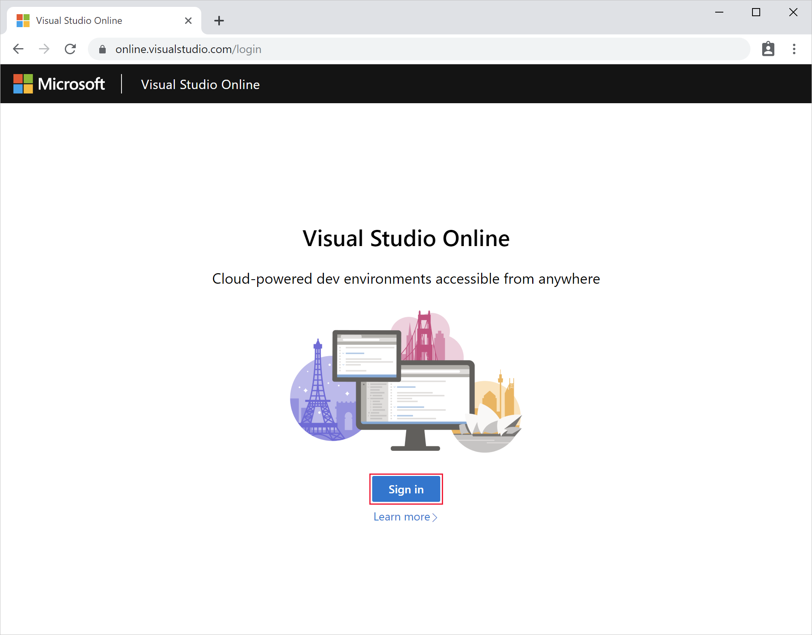

Follow the prompts in the pop-up dialog to complete sign in.

## Create a plan

Once you've [signed up](#sign-up) and created an Azure subscription, you can access VS Online by creating a VS Online Plan. You can create more than one plan, and plans can be used to group related environments together. They are also the unit of billing, and as such you'll see a line item on your Azure bill for each plan you create.

More information about plans and pricing is available on [the VS Online pricing page](https://aka.ms/vso-pricing).

To create a new plan, browse to the [environments listing page](https://online.visualstudio.com/environments) and either using the blue **Create new plan** button (if it's available), or by clicking the **Create new plan** in the **Plan Selector** dropdown in the header bar.

Fill in the form to select an Azure subscription to associate the plan with, an Azure resource group to create the plan in, an Azure region to geo-locate the plan in, and specify a name for the plan itself.

- **Subscription**: You can choose from any existing Azure subscription.
- **Resource Group**: Your VS Online plan will be created in the existing Azure resource group selected.
- **Region**: Choose an [Azure region](https://azure.microsoft.com/global-infrastructure/regions/) to create the VS Online plan in. All environments created within this plan, will be provisioned in the region selected. Supported regions are:
  - East US
  - Southeast Asia
  - West Europe
  - West US 2
- **Plan Name**: The name of the created VS Online plan. This name is displayed in the **Plan Selector** for organization purposes.

Once a plan is created, it will be the selected plan in the **Plan Selector**.

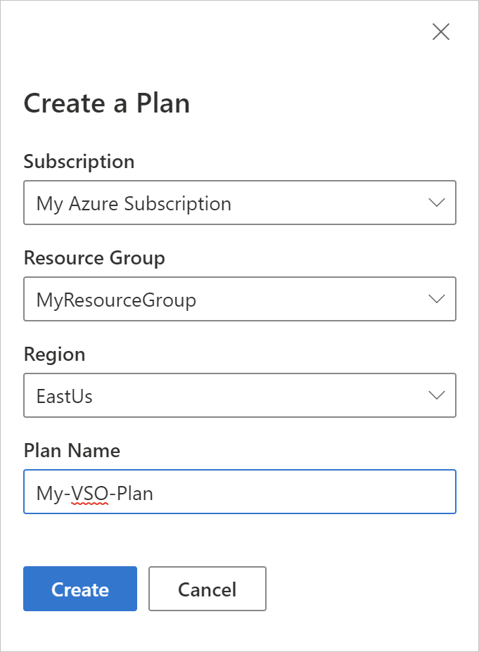

Only environments contained within the selected plan will be displayed. To select a different plan, use the **Plan Selector** menu.

## Create an environment

> [!NOTE]
> Cloud-hosted environments are extremely configurable. See [configuring environments](../reference/configuring.md) for advanced information about how to configure your environments.
>[!TIP]
> Want to bring your existing environment or need specialized hardware? Try out our [self-hosted offering](self-hosting-vscode.md)!

To create a new cloud-hosted environment in VS Online, from the [environments listing page](https://online.visualstudio.com/environments) click the **Create environment** button.

Complete the form to provide an environment name, path to Git repository (optional), auto-suspend settings, and an instance type.

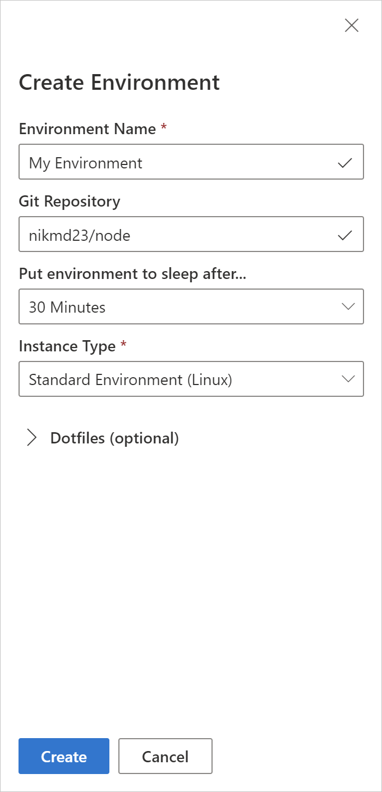

- **Environment Name**: You can name your environment anything you'd like, but we recommend naming it after the project or task that you'll be using it for. (e.g. 'Todo App Environment', 'PR Review', 'Shopping Cart Feature')
- **Git Repository**: If a path to a Git repository is provided, VS Online will automatically clone that repository into the environment. You can refer to our [repository reference](../reference/repository.md) on the supported url types and providers.
- **Auto-suspend Setting**: The length of disconnected time before a VS Online environment will be automatically suspended. Choose between:
  - 5 minutes
  - 30 minutes
  - 2 hours
- **Instance Type**: The CPU and memory configuration that will be provisioned for your environment. Choose **Standard Environment (Linux)** for most projects, and **Premium Environment (Linux)** for those that require a little extra power. More information about instance types is available at our [pricing page](https://aka.ms/vso-pricing).

> [!NOTE]
> Windows based instance types are available as part of our VS Online for Visual Studio Private Preview. [Sign up](https://aka.ms/vsfutures-signup) to receive access.
> [!TIP]
> The guided environment creation experience described above supports Git repositories over the HTTP(S) scheme. To use another source control provider, or Git over SSH, simply leave the **Git Repository** setting blank, and use the environment's terminal support to clone your source code.
> [!NOTE]
> Optional dotfiles configuration options are covered in the [Personalizing environments](../reference/personalizing.md) reference document.

## Connect to an environment

Once you finish [creating an environment](#create-an-environment), an **Available** badge will appear when the environment is ready.

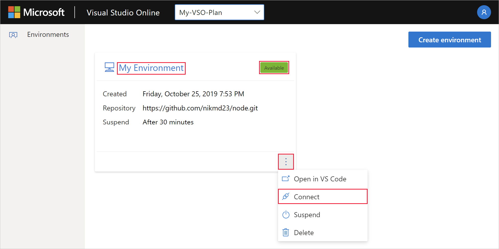

From there, you can either click on the name of the environment (**My Environment** in this screenshot) or, click the context menu and select **Connect**. Taking either of these actions will cause your browser to navigate to VS Online's browser-based editor and begin the connection sequence. When the connection is complete you'll be able to inspect details about the currently selected environment in the **Environment Details** panel in the **Remote Explorer** side bar.

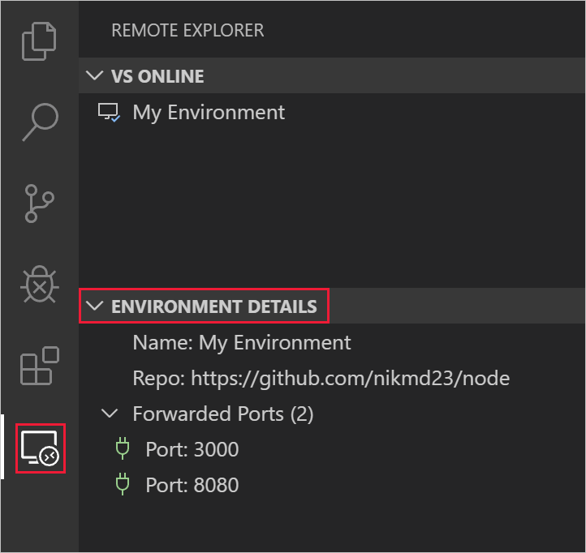

> [!NOTE]
> If you are already connected to an environment in VS Online's browser based editor, you can connect to another environment using any of the techniques covered in the [Visual Studio Code how-to](vscode.md#connect-to-an-environment) document.

## Disconnect from an environment

Once connected to an environment, there's four ways to disconnect:

1. Use the **VS Online: Disconnect** command in the [command palette](https://code.visualstudio.com/docs/getstarted/userinterface#_command-palette).
2. Right-click the name of the connected environment in the **VS Online** panel to reveal a context menu with a **Disconnect** option.
3. Selecting the **Disconnect** button on the **Environment Details** title bar in the **Remote Explorer** side bar.
4. Close the browser tab

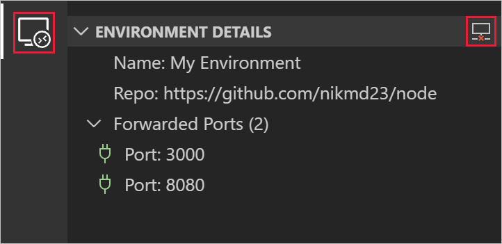

## Suspend an environment

As described on the [VS Online pricing page](https://aka.ms/vso-pricing), you pay for active VS Online usage, with a nominal fee for when an environment is suspended.

VS Online will automatically suspend an inactive environment according to the auto-suspend setting used when the environment was created. This helps keep the costs of VS Online as low as possible.

In addition to auto-suspending, you can manually suspend an environment at any time by using the **VS Online: Suspend Environment** command in the command palette, or by selecting **Suspend Environment** in the right-click context menu on any environment listed in the **VS Online** panel of the **Remote Explorer** side bar.

Environments can also be suspended in VS Online's management panel by clicking the context menu and selecting **Suspend**.

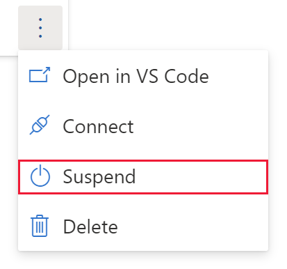

<!-- TODO: Add context menu screenshot -->

## Delete an environment

The actively connected environment cannot be deleted from within VS Online's browser-based editor, instead, it can be deleted in the management portal by clicking the context menu and selecting **Delete**.

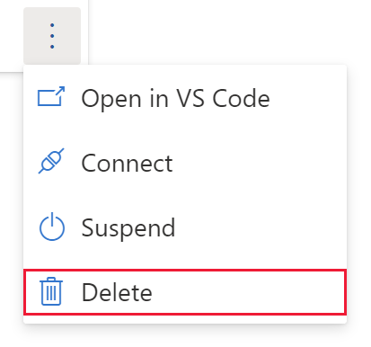

> [!NOTE]
> If you are already connected to an environment in VS Online's browser based editor, you can delete other environments using any of the techniques covered in the [Visual Studio Code how-to](vscode.md#delete-a-cloud-hosted-environment) document.

## Using the integrated terminal

VS Online's browser based version of VS Code includes support for VS Code's integrated terminal and all of its features. It is important to note, however, that while connected to VS Online, commands issued in the terminal are executed against the environment, not the user's local machine. This provides VS Online users full control over their development environment and how it's configured.

> [!TIP]
> The [integrated terminal is fully documented on the VS Code site](https://code.visualstudio.com/docs/editor/integrated-terminal).

VS Online exposes information about the configuration and creation of an environment in the **VS Online** terminal. This terminal is read-only, and is meant to be used for troubleshooting purposes.

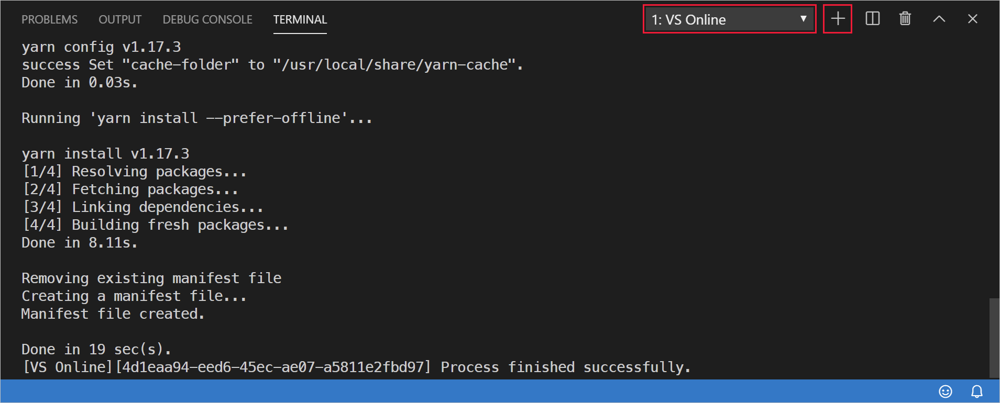

Attempts to type in the **VS Online** terminal window will issue a warning notification toast. Press the **Open in New Terminal** button in the toast, or the **New Terminal** icon in the **Terminal** panel to create a new, writable terminal instance.

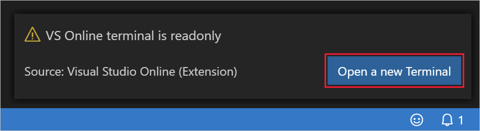

In addition to the standard integrated terminal features of VS Code, VS Online also allows for the terminal to be personalized using custom dotfiles. See [Personalizing environments](../reference/personalizing.md) for more information.

## Port Forwarding

VS Online provides access to the applications and services running in remote environments by means of port forwarding. By default, no ports are forwarded for security concerns, however, there are several ways to open ports in the remote environment.

### Auto port forwarding

If your application, or any other, indicates that it is serving content from a local port in the integrated terminal, VS Online will automatically forward that port and add it to the list of **Forwarded Ports** under **Environment Details**.

In the example below, `npx` is used to run `http-server`, which opens port `8080`. VS Online correspondingly and automatically forwards port `8080` so it can be accessed from your local environment.

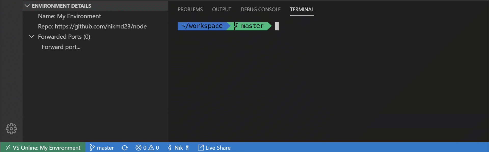

### Port forwarding interface

As with all operations in VS Online, you can use the command palette to forward a port. Select the **VS Online: Forward Port** command and follow its prompts: typing in a port number to forward, and to assign an optional name to the port forwarding rule.

Additionally, you can click the **Forward Port** button on the **Forwarded Ports** title bar in the **Environment Details** panel.

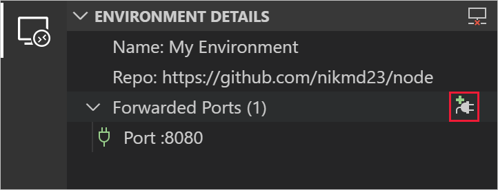

### Configured port forwarding

If there's one or more ports that should be forwarded by default for a given repository, that can be configured in `devcontainer.json`. See the [configuring environments](../reference/configuring.md) reference for more info.

### Accessing forwarded ports

Once a port has been forwarded, you can click the **Copy Port URL** button on the port's title bar in the **Environment Details** panel. This will copy the full URL to the port into your clipboard so you can paste it into a browser, CLI or the API exploration tool of your choice.

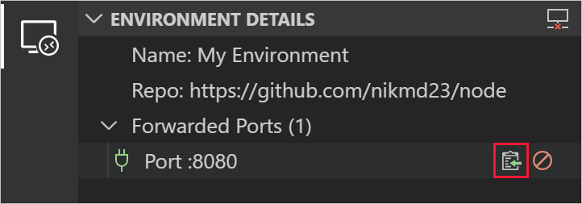

### Stop forwarding ports

There's two ways to stop a forwarded port, regardless of which mechanism was used to create it. You can either use the **VS Online: Stop Forwarding Port** command in the command palette, or click the **Stop Forwarding Port** button on the port's title bar in the **Environment Details** panel.

## Configuration and personalization

In addition to the above documentation that's specific to VS Online's browser-based experience, VS Online also provides flexible mechanisms to customize environments on a per repo basis, as well as to personalize them on a per user basis. Find out more in the reference documentation:

- [Configuring environments](../reference/configuring.md)
- [Personalizing environments](../reference/personalizing.md)
