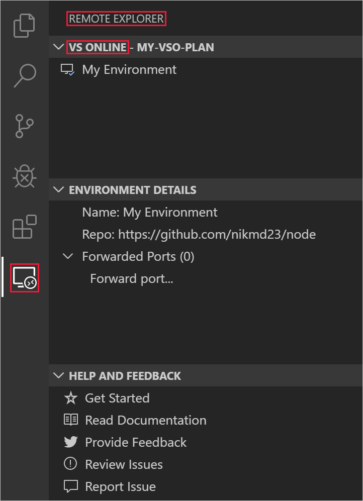
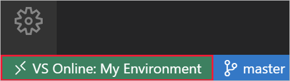
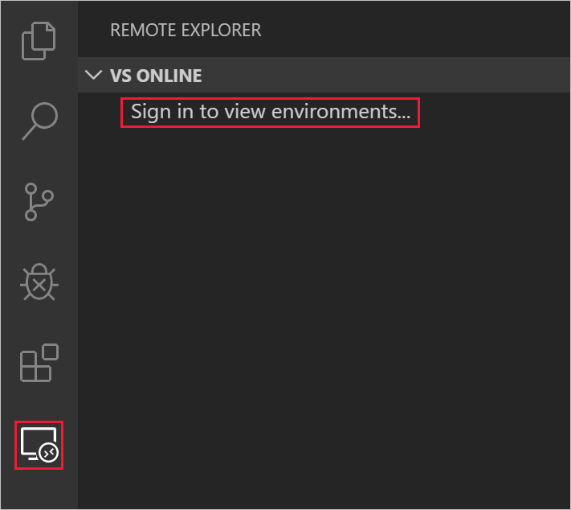
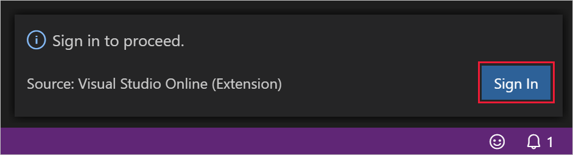
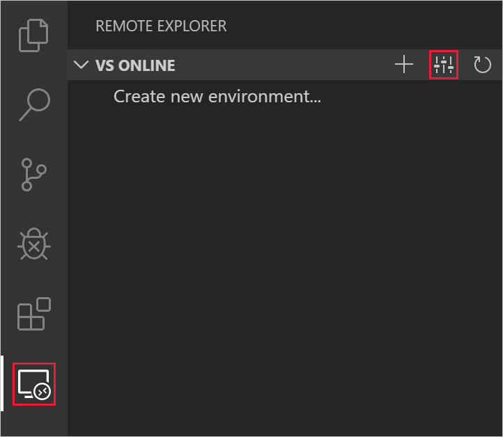
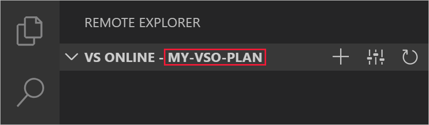
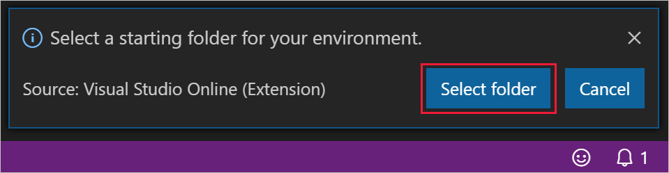
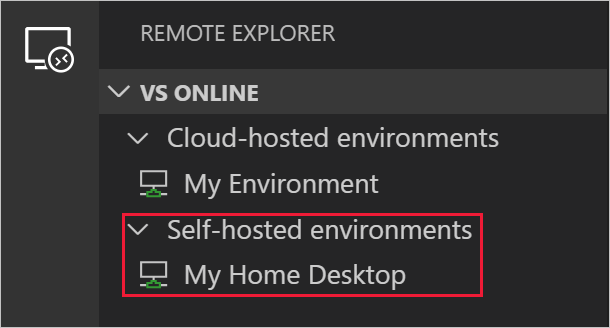

# Register a self-hosted VS Online environment with Visual Studio Code

You can host VS Online on your own environment using Visual Studio Code. This article describes how to register and connect to a self-hosted VS Online environment.

If you want to register a machine where interacting with Visual Studio Code UI isn't possible (e.g. a server or headless OS), see [Register a headless, self-hosted VS Online environment](self-hosting-cli.md).

> [!NOTE]
> A Microsoft Account and Azure Subscription are required to use Visual Studio Online. Sign up for a Microsoft Account and Azure Subscription at [https://azure.microsoft.com/free/](https://azure.microsoft.com/free/).

## Install

You'll need to have [Visual Studio Code](https://code.visualstudio.com/) and the [VS Online extension](https://aka.ms/vso-dl) installed on the machine you wish to register. To install Visual Studio Code, see [Download Visual Studio Code](https://code.visualstudio.com/download).

Install the [VS Online extension](https://aka.ms/vso-dl) from the [VS Code Marketplace](https://marketplace.visualstudio.com/VSCode) by clicking on the green install button near the top of the page and following the prompts or from within VS Code by searching for '*Visual Studio Online*' within the **Extensions** side bar, selecting the extension from the list, and pressing the **Install** button.

When successfully installed, the **VS Online** panel will be available in the **Remote Explorer** pane.

The panel shown in the previous screenshot provides a management interface for interacting with VS Online environments, and is covered in full detail in the following sections.

In addition to the panel, Visual Studio Code will also show the remote indicator when the VS Online extension is installed. The remote indicator signals your connection status, and provides a list of available VS Online commands when clicked.

## Sign In

To sign into VS Online, you can either press `F1` and select the **VS Online: Sign In** command in the [command palette](https://code.visualstudio.com/docs/getstarted/userinterface#_command-palette), or click **Sign in to view environments...** in **VS Online** panel of the **Remote Explorer** side bar.

From there, press the **Sign In** button on the notification toast that appears, and follow the prompts in your browser.

<!-- TODO: 
Add content for:
- Filtering Azure Subscription
-->

## Create a plan

Once you've signed up and created an Azure subscription, you can access VS Online by creating a VS Online Plan. You can create more than one plan, and plans can be used to group related environments together. To sign up, see [Create an Azure free account](https://azure.microsoft.com/free/).

To create a new plan, you can either use the **VS Online: Create Plan** command in the [command palette](https://code.visualstudio.com/docs/getstarted/userinterface#_command-palette), or by clicking the **Select Plan** button on the **VS Online** title bar in the **Remote Explorer** side bar, then selecting **Create new plan...** from the quick pick list.

Follow the prompts to select an Azure subscription to associate the plan with, an Azure region to create the plan in, a name for the Azure resource group to create the plan in, and a name for the plan itself.

- **Azure subscription**: You can choose from any Azure subscriptions that was previously selected. To add or remove options from the list, use the **Azure: Select Subscriptions** command in the command palette.
- **Azure region**: Choose an [Azure region](https://azure.microsoft.com/global-infrastructure/regions/) to create the VS Online plan in. All environments created within this plan will be provisioned in the selected region. Supported regions are:
  - East US
  - Southeast Asia
  - West Europe
  - West US 2
- **Azure resource group name**: Your VS Online plan will be created in a new Azure resource group with the name provided in this step.
- **VS Online plan name**: The name of the created VS Online plan. This name is displayed in the **Remote Explorer** for organization purposes.

Once a plan is created, it will be the selected plan in the **Remote Explorer**.

Only environments contained within the selected plan will be displayed. To select a different plan, you can either use the **VS Online: Select Plan** command in the command palette, or by clicking the **Select Plan** button on the **VS Online** title bar.

## Register your environment

Select the **VS Online: Register Self-hosted Environment** command in the [command palette](https://code.visualstudio.com/docs/getstarted/userinterface#_command-palette) or select **Register self-hosted environment...** under the **Self-hosted environments** node in the **VS Online** panel of the **Remote Explorer** side bar:

- If no folders are currently open in VS Code, you will be prompted to select one. This folder will be opened every time you connect to this environment from another machine. However, you can open any folder after connecting.

- If no plan is selected, you will be prompted to select or create a plan. No charge is incurred for self-hosted environments.

- You'll be asked to select how the self-hosted agent is run:
  - **Register a service:** Allows the agent to be registered as a system service and persists after environment restarts.
        > [!NOTE]
        > You must run VS Code as an administrator to be able to select this option. You will be prompted to provide an admin username and password to complete registration.
    - **Run as a process:** A temporary registration that terminates upon machine shutdown/restart.

After registering, your self-hosted environment will appear under the **Self-hosted environments** node in the **VS Online** panel of the **Remote Explorer** side bar.

## Access your environment

You can now connect from any machine with the VS Online extension installed or from the [VS Online portal](https://online.visualstudio.com/environments) in the browser. The first time you connect may take longer than usual.

If your self-hosted environment becomes unavailable for any reason, see our [troubleshooting](../resources/troubleshooting.md#self-hosted-environments) reference documentation.
