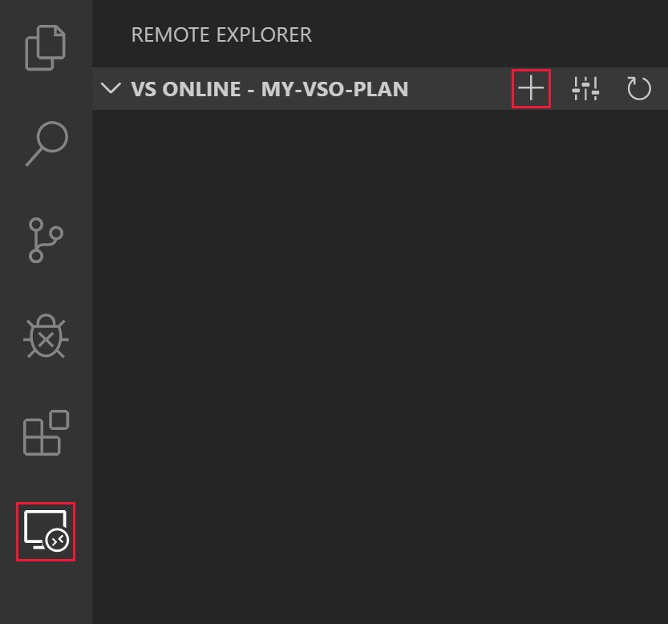
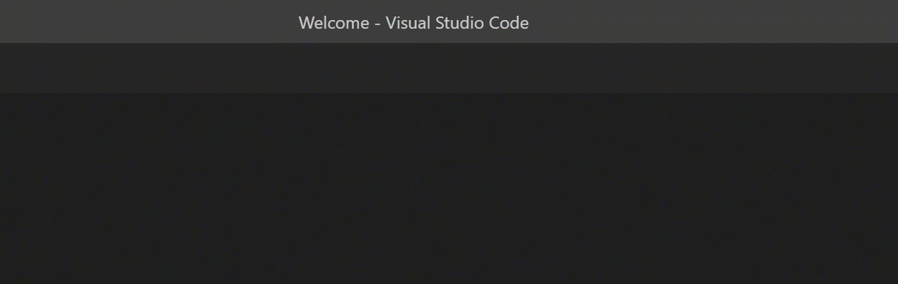
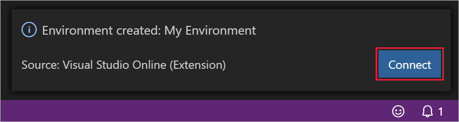

# Visual Studio Online VS Code How-to

## Sign Up

A Microsoft Account and Azure Subscription are required to use Visual Studio Online.

You can sign up for both, as well as receive various Azure incentives at [https://azure.microsoft.com/free/](https://azure.microsoft.com/free/).

## Install

> [!TIP]
> If you don't have [Visual Studio Code](https://code.visualstudio.com/) installed already, you can download it [here](https://code.visualstudio.com/download).

If you'd like to use VS Online from within Visual Studio Code, you'll have to install the VS Online extension. There's two ways to do that:

### Install from Visual Studio Code Marketplace

You can install the [VS Online extension](https://aka.ms/vso-dl) from the [VS Code Marketplace](https://marketplace.visualstudio.com/VSCode) by clicking on the green install button near the top of the page and following the prompts.

<!-- TODO: SCREENSHOT NEEDED 1 -->

### Install from within Visual Studio Code

Alternatively, from within VS Code search for '*Visual Studio Online*' within the **Extensions** side bar, select the extension from the list, and press the **Install** button.

<!-- TODO: SCREENSHOT NEEDED 2 -->

### Post installation

When successfully installed, the **VS Online** panel will be available in the **Remote Explorer** pane.

This panel provides a management interface for interacting with VS Online environments, and is covered in full detail in the remainder of this document.

In addition to the panel, VS Code will also show the remote indicator when the VS Online extension is installed. The remote indicator signals your connection status, and provides a list of available VS Online commands when clicked.

## Sign In

To sign into VS Online, you can either press `F1` and select the **VS Online: Sign In** command in the [command palette](https://code.visualstudio.com/docs/getstarted/userinterface#_command-palette), or click **Sign in to view environments...** in **VS Online** panel of the **Remote Explorer** side bar.

From there, press the **Sign In** button on the notification toast that appears, and follow the prompts in your browser.

<!-- TODO: 
Add content for:
- Filtering Azure Subscription
-->

## Create a plan

Once you've [signed up](#sign-up) and created an Azure subscription, you can access VS Online by creating a VS Online Plan. You can create more than one plan, and plans can be used to group related environments together. They are also the unit of billing, and as such you'll see a line item on your Azure bill for each plan you create.

More information about plans and pricing is available on [the VS Online pricing page](https://aka.ms/vso-pricing).

The first time you [create an environment ](#create-a-cloud-hosted-environment), VS Code will automatically walk you through the steps required to create a plan. To explicitly create a new plan, you can either use the **VS Online: Create Plan** command in the [command palette](https://code.visualstudio.com/docs/getstarted/userinterface#_command-palette), or by clicking the **Select Plan** button on the **VS Online** title bar in the **Remote Explorer** side bar, then selecting **Create new plan...** from the quick pick list.

Follow the prompts to select an Azure subscription to associate the plan with, an Azure region to create the plan in, a name for the Azure resource group to create the plan in, and a name for the plan itself. 

- **Azure subscription**: You can choose from any Azure subscriptions that was previously selected. To add or remove options from the list, use the **Azure: Select Subscriptions** command in the command palette.
- **Azure region**: Choose an [Azure region](https://azure.microsoft.com/global-infrastructure/regions/) to create the VS Online plan in. All environments created within this plan, will be provisioned in the region selected. Supported regions are:
  - East US
  - Southeast Asia
  - West Europe
  - West US 2
- **Azure resource group name**: Your VS Online plan will be created in a new Azure resource group with the name provided in this step.
- **VS Online plan name**: The name of the created VS Online plan. This name is displayed in the **Remote Explorer** for organization purposes.

Once a plan is created, it will be the selected plan in the **Remote Explorer**. 

Only environments contained within the selected plan will be displayed. To select a different plan, you can either use the **VS Online: Select Plan** command in the command palette, or by clicking the **Select Plan** button on the **VS Online** title bar.

## Create a cloud-hosted environment

> [!NOTE]
> Cloud-hosted environments are extremely configurable. See [configuring environments](../reference/configuring.md) for advanced information about how to configure your environments.
>[!TIP]
> If you've already got a configured environment or need specialized hardware VS Online doesn't currently support, check out our [self-hosted guide](self-hosting-vscode.md).

To create a new cloud-hosted environment in VS Online, you can either use the **VS Online: Create New Environment** command in the [command palette](https://code.visualstudio.com/docs/getstarted/userinterface#_command-palette), or by selecting the **Create New Environment** button on the **VS Online** title bar in the **Remote Explorer** side bar.

<!-- TODO: "Create new environment" should be in this screenshot -->

Follow the prompts to provide an environment name, path to Git repository (optional) and auto-suspend settings.

- **Name**: You can name your environment anything you'd like, but we recommend naming it after the project or task that you'll be using it for. (e.g. 'Todo App Environment', 'PR Review', 'Shopping Cart Feature')
- **Git Repository**: If a path to a Git repository is provided, VS Online will automatically clone that repository into the environment. You can specify a Git repository in one of many formats:
  - **Absolute Http(s) Git URL**: A complete Http or Https Url. It may end in a `.git` extension. Examples include:
    - https://github.com/organization/repo.git
    - https://organization@dev.azure.com/organization/repo/_git/repo
    - https://username@bitbucket.org/organization/repo.git
  - **GitHub Project URL**: The Https Url used to navigate to the homepage of a project on GitHub. (e.g. https://github.com/organization/repo)
  - **GitHub Short Form**: The forward slash delimited `organization/repo` format used to refer to projects on GitHub.
  - **GitHub Pull Request URL**: The Https Url used to navigate to a pull request in GitHub. (e.g. https://github.com/organization/repo/pull/123)
- **Auto-suspend Setting**: The length of disconnected time before a VS Online environment will be automatically suspended. Choose between:
  - 5 minutes
  - 30 minutes
  - 2 hours
- **Instance Type**: The CPU and memory configuration that will be provisioned for your environment. Choose **Standard Environment (Linux)** for most projects, and **Premium Environment (Linux)** for those that require a little extra power. More information about instance types is available at our [pricing page](https://aka.ms/vso-pricing).

> [!NOTE]
> Windows based instance types are available as part of our VS Online for Visual Studio Private Preview. [Sign up](https://aka.ms/vsfutures-signup) to receive access.

> [!TIP]
> The guided environment creation experience described above supports Git repositories over the HTTP(S) scheme. To use another source control provider, or Git over SSH, simply leave the **Git Repository** setting blank, and use the environment's terminal support to clone your source code.

<!-- TODO: Add information about instance type/SKU -->

## Connect to an environment

VS Code makes connecting to environments quick and easy. If you were already connected to an environment when you last shut down VS Code, it will automatically try to re-connect to that environment when you launch it.

If you're [creating an environment](#create-a-cloud-hosted-environment), a notification toast will appear as soon as the environment is ready. Simply select the **Connect** button to connect to the new environment.

No matter what, when you're in the process of connecting, VS Code's **Remote Indicator** will animate during the connection process, and will display the name of the environment once the connection has completed.

To connect to already existing environment, that you're not currently connected to, there's several options:

1. Use the **VS Online: Connect to Environment** command in the [command palette](https://code.visualstudio.com/docs/getstarted/userinterface#_command-palette) to be displayed with a quick pick list of environments to connect to.
2. Alternatively, the quick pick list is displayed by left-clicking the name of any environment in the **VS Online** panel in the **Remote Explorer** side bar.
3. For more advanced options, right-click the name of the environment in the **VS Online** panel to reveal a context menu with the following options:
   - **Connect to Environment**: Click to immediately connect to the selected environment.
   - **Open Environment in New Window**: Click to launch a new VS Code instance that will connect to the selected environment. This is useful for being connected to multiple environments at once.
   - **Open in Browser**: Click to launch the environment in VS Online's browser-based editor.

Lastly, you can inspect details about the currently selected environment in the **Environment Details** panel in the **Remote Explorer** side bar.

<!-- TODO: Fix "connected" icon next to "My Environment" -->

## Disconnect from an environment

Once connected to an environment, there's four ways to disconnect:

1. Use the **VS Online: Disconnect** command in the [command palette](https://code.visualstudio.com/docs/getstarted/userinterface#_command-palette).
2. Right-click the name of the connected environment in the **VS Online** panel to reveal a context menu with a **Disconnect** option.
3. Selecting the **Disconnect** button on the **Environment Details** title bar in the **Remote Explorer** side bar.
4. Close the VS Code window

<!-- TODO: Fix "connected" icon next to "My Environment" and add My-VSO-Plan in title bar -->

## Suspend an environment

As described on the [VS Online pricing page](https://aka.ms/vso-pricing), you pay for active VS Online usage, with a nominal fee for when an environment is suspended. 

VS Online will automatically suspend an inactive environment according to the auto-suspend setting used when the environment was created. This helps keep the costs of VS Online as low as possible.

In addition to auto-suspending, you can manually suspend an environment at any time by using the **VS Online: Suspend Environment** command in the command palette, or by selecting **Suspend Environment** in the right-click context menu on any environment listed in the **VS Online** panel of the **Remote Explorer** side bar.

<!-- TODO: Add context menu screenshot -->

## Delete a cloud-hosted environment

The actively connected environment cannot be deleted from within VS Code, however while [disconnected from an environment](#disconnect-from-an-environment), there's two ways to permanently delete it:

1. Use the **VS Online: Delete Environment** command in the [command palette](https://code.visualstudio.com/docs/getstarted/userinterface#_command-palette) to select the environment to be deleted then press the **Delete** button on the confirmation prompt.
2. Right-click the name of the disconnected environment in the **VS Online** panel to reveal a context menu with a **Delete Environment** option. Select it and press the **Delete** button on the confirmation prompt.

## Unregister a self-hosted environment

A self-hosted environment can be unregistered from any machine in one of two ways:

1. Use the **VS Online: Unregister Environment** command in the [command palette](https://code.visualstudio.com/docs/getstarted/userinterface#_command-palette) to select the environment to be unregistered then press the **Unregister** button on the confirmation prompt.
2. Right-click the name of the disconnected environment in the **VS Online** panel to reveal a context menu with an **Unregister Environment** option. Select it and press the **Unregister** button on the confirmation prompt.

## Using the integrated terminal

VS Code's integrated terminal and all of its features are fully supported in VS Online. It is important to note, however, that while connected to VS Online, commands issued in the terminal are executed against the environment, not the user's local machine. This provides VS Online users full control over their development environment and how it's configured.

> [!TIP]
> The [integrated terminal is fully documented on the VS Code site](https://code.visualstudio.com/docs/editor/integrated-terminal).

VS Online exposes information about the configuration and creation of an environment in the **VS Online** terminal. This terminal is read-only, and is meant to be used for troubleshooting purposes.

Attempts to type in the **VS Online** terminal window will issue a warning notification toast. Press the **Open in New Terminal** button in the toast, or the **New Terminal** icon in the **Terminal** panel to create a new, writable terminal instance.

In addition to the standard integrated terminal features of VS Code, VS Online also allows for the terminal to be personalized using custom dotfiles. See [Personalizing environments](../reference/personalizing.md) for more information.

## Port Forwarding

VS Online provides access to the applications and services running in remote environments by means of port forwarding. By default, no ports are forwarded for security concerns, however, there are several ways to open ports in the remote environment.

### Auto port forwarding

If your application, or any other, indicates that it is serving content from a local port in the integrated terminal, VS Online will automatically forward that port and add it to the list of **Forwarded Ports** under **Environment Details**.

In the example below, `npx` is used to run `http-server`, which opens port `8080`. VS Online correspondingly and automatically forwards port `8080` so it can be accessed from your local environment. 

### Port forwarding interface

As with all operations in VS Online, you can use the command palette to forward a port. Select the **VS Online: Forward Port** command and follow its prompts: typing in a port number to forward, and to assign an optional name to the port forwarding rule.

Additionally, you can click the **Forward Port** button on the **Forwarded Ports** title bar in the **Environment Details** panel.

### Configured port forwarding

If there's one or more ports that should be forwarded by default for a given repository, that can be configured in `devcontainer.json`. See the [configuring environments](../reference/configuring.md) reference for more info.

### Accessing forwarded ports

Once a port has been forwarded, you can click the **Copy Port URL** button on the port's title bar in the **Environment Details** panel. This will copy the full URL to the port into your clipboard so you can paste it into a browser, CLI or the API exploration tool of your choice.

### Stop forwarding ports

There's two ways to stop a forwarded port, regardless of which mechanism was used to create it. You can either use the **VS Online: Stop Forwarding Port** command in the command palette, or click the **Stop Forwarding Port** button on the port's title bar in the **Environment Details** panel.

## Configuration and personalization

In addition to the above documentation that's specific to VS Code's VS Online extension, VS Online also provides flexible mechanisms to customize environments on a per repo basis, as well as to personalize them on a per user basis. Find out more in the reference documentation:

- [Configuring environments](../reference/configuring.md)
- [Personalizing environments](../reference/personalizing.md)
