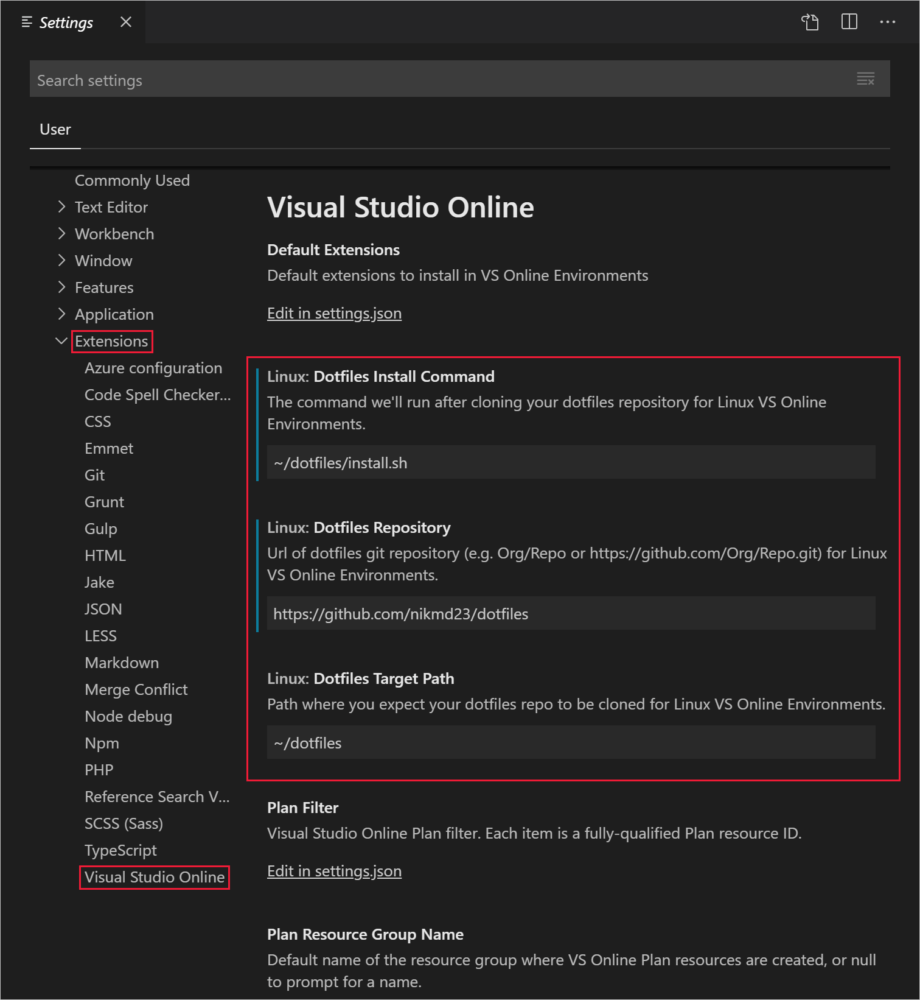
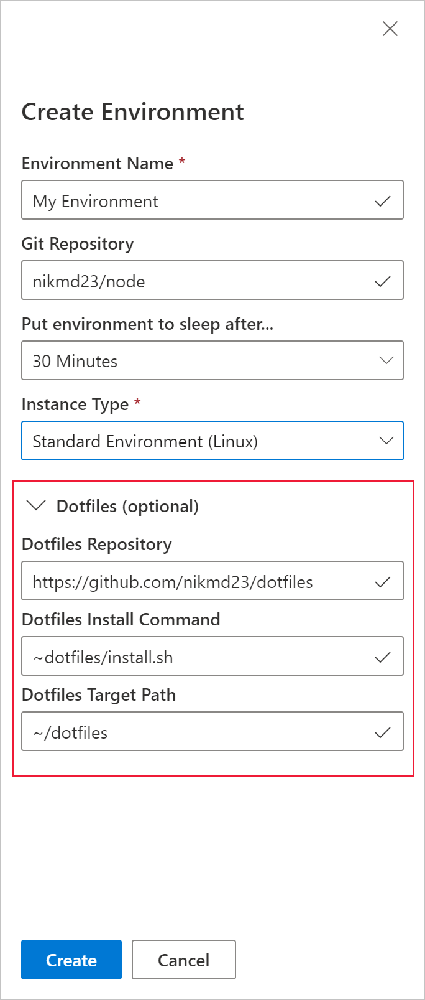

# Personalizing

Visual Studio Online's [environments](../overview/what-is-vsonline.md#environments) are fully personalizable on a per user basis. This is accomplished by referencing a "dotfiles repo" at environment creation time.

Dotfiles are files whose filename begins with a dot (`.`). They typically contain configuration information for various applications. They are used to control the way terminals, editors, source control and other various tools behave. `.bashrc`, `.gitignore` and `.editorconfig` are examples of dotfiles commonly used by developers. 

It is common practice for developers to put their dotfiles on GitHub, so they can easily synchronize them between all of their development environments. If you don't have your own collection of carefully crafted dotfiles already, be sure to check out one of the [many dotfiles bootstrap projects](https://dotfiles.github.io/) that exist.

## Visual Studio Online personalization reference

To configure a dotfiles repo in Visual Studio Code, press `F1` and select the **Preferences: Open Setting (UI)** command in the [command palette](https://code.visualstudio.com/docs/getstarted/userinterface#_command-palette).

In the **Settings** tab that opens, select the **Extensions** node in the navigation tree, followed by **Visual Studio Online**. 

You can also configure dotfiles in from [online.visualstudio.com](https://online.visualstudio.com). Press the **Create environment** button, and expand the **Dotfiles (optional)** settings.

In both experiences, there's three options that can be configured:

1. **Dotfiles Repository**: The URL of the Git repository that contains your desired dotfiles. (*Required to personalize an environment, optional otherwise*)
2. **Dotfiles Target Path**: The path where the dotfiles repo will be cloned. Defaults to `~dotfiles`. (*Optional*)
3. **Dotfiles Install Command**: The command to run after cloning the dotfiles repository. By default, VS Online scans the dotfiles repository and runs one of the following files:
    - `install.sh`
    - `install`
    - `bootstrap.sh`
    - `bootstrap`
    - `setup.sh`
    - `setup`
    
    If none of these files are found, then any files and folders starting with `.` are symlinked to the home (`~` or `$HOME` on Linux) directory.

Once the **Dotfiles Repository** is configured in VS Code, any environments created going forward will be personalized.