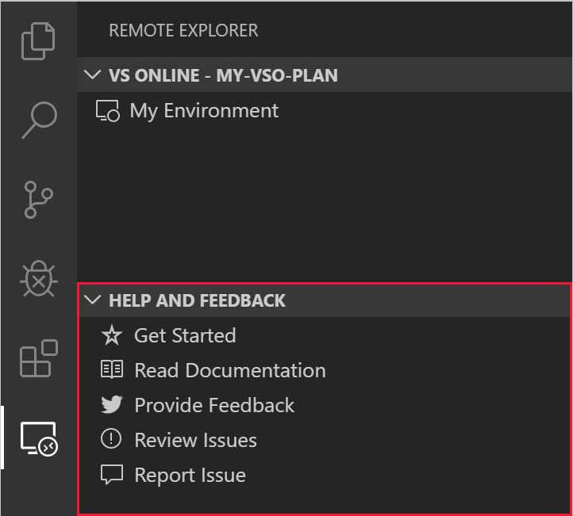

# Feedback

Feedback for Visual Studio Online is collected in [our documentation repository on GitHub](https://github.com/MicrosoftDocs/vsonline/).

- **Issues**: Feel free to search through the list of [open bugs](https://github.com/MicrosoftDocs/vsonline/labels/bug) and [feature enhancements](https://github.com/MicrosoftDocs/vsonline/labels/enhancement), and certainly don't hesitate to [submit your own](https://github.com/MicrosoftDocs/vsonline/issues/new), or up vote one with a 👍🏻 reaction!
- **Twitter**: Interact with us on Twitter! Just be sure to use the [#vsonline](https://twitter.com/search?q=%23vsonline&src=typed_query&f=live) hashtag.

Additionally, look for the **Help and Feedback** panel in the **Remote Explorer** for a quick and easy way to get to our feedback channels.

